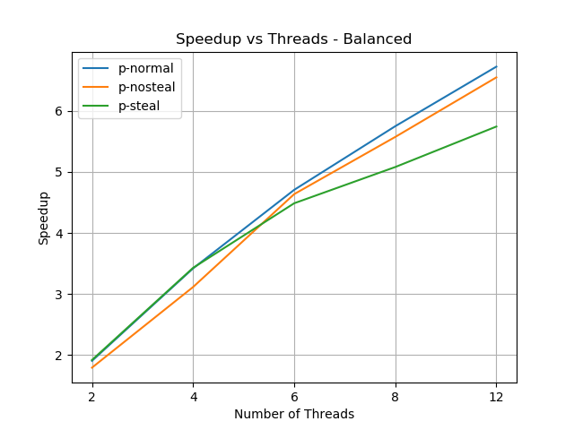
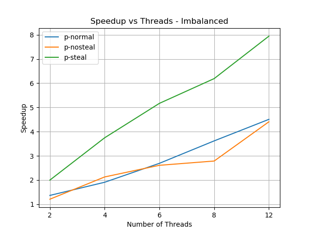

# Parallel-Model-Evaluator
Accelerate Model Evaluation: Precision-Recall Curve Plotting with Parallel Work-Stealing Implementation

# Project Report - Sentiment Analysis Threshold Tuning

## Overview
In this project, I worked on creating a program to test and tune different thresholds for a sentiment analysis model. I used the VADER sentiment analysis tool available [here](https://github.com/grassmudhorses/vader-go), which is a lexicon and rule-based sentiment analysis tool specifically attuned to sentiments expressed in social media. The program focuses on choosing the best threshold for a negative sentiment VADER based model.

The program takes an input data file with labeled data and runs the VADER tool for a range of thresholds on each data point. For each prediction, the tool outputs a negative valence score (between 0 and 1) indicating how negative the text is. The program aims to test the tool using all the defined thresholds – ranging from 0.1 to 0.75 with 0.05 increments – compute the precision/recall metrics for each threshold, print/save the maximum values and the corresponding threshold values in a text file, and finally plot the Precision-Recall curve.

The thresholds are limited to 0.75 as for this specific dataset anything above that results in the same metrics.

## Metrics
The program calculates the precision and recall for each threshold given the annotated labels. It also calls a Python script to create a plot of the Precision-Recall curve for the results. Lastly, it stores the results in a text file. All these files and plots can be found in the results directory.

## Data
I used a ChatGPT Sentiment Analysis dataset (with roughly 220000 rows) which contains tweets about chatgpt that were gathered for a month, and then the sentiment labels were made using Natural Language Processing. The raw dataset is available on [Kaggle](https://www.kaggle.com), however, some preprocessing was done after downloading the raw file. The final datasets used can be found on [Google Drive](https://drive.google.com/file/d/1yUroNRXKSkeivANnRX2dhiGC_KeXB1y9/view?usp=sharing) and include 2 CSV files:
- balanced.csv - this contains the raw data with preprocessing only affecting the labels and headers of the file
- unbalanced.csv - this contains the same data as balanced.csv but the rows are sorted in descending order based on the length of the text

The idea behind creating two datasets is to judge the performance of multiple parallel implementations in different scenarios which will be described below. The program can be extended to be used for any dataset and/or Sentiment Analysis model with only minor modifications in the prediction logic.

## Implementations

### Sequential (s)
All rows in the dataset are processed sequentially by a single thread. The main goroutine goes through each row for each given threshold one by one and updates the metrics.

### Parallel (p-normal)
This implementation is based on the BSP pattern. For each threshold, the main goroutine breaks the dataset into equal chunks based on the number of threads provided. It then spawns each goroutine with its own chunk start and end in parallel. A custom barrier using a condition variable is used to ensure that the main goroutine waits for all threads to complete their own tasks before proceeding to combine the results from all threads. Each threshold acts as a superstep in this implementation, with the barrier logic combining results from each thread and spawning the threads for the next superstep. Each goroutine is spawned with indices for their chunk’s start and end and a pointer to the data, and thus there is no extra work required to divide tasks between all threads.

### Parallel with Deques (p-nosteal)
This implementation is similar to the p-normal implementation, but each thread has a deque of tasks instead of indices for their chunk. The main goroutine again calculates the start/end of each chunk, but instead of passing the indices, it creates a new deque for each thread and adds all tasks to this deque. Then it spawns all threads by passing their respective deques. Each thread continuously pops a task from its queue and processes it until its own queue is empty, after which the thread exits. The only difference between this implementation and p-normal is the extra overhead of creating the deques for each thread before spawning the threads.

### Parallel with Deques and Stealing (p-steal)
This implementation involves work stealing between threads. Similar to p-nosteal, the main goroutine creates a deque for each thread and spawns threads by passing their respective deques. Each thread again continuously pops a task from its queue and processes it until it is empty. However, once a thread’s own queue is empty, it attempts to steal a task from other threads. The thread chooses another thread at random and tries to steal a task from the top of the queue. If it succeeds it processes the task and repeats, if it fails it simply tries again. This continues until all threads have completed their tasks and all queues are empty. Global synchronization is achieved by using an atomic counter that is updated by a thread when its queue is empty, and all threads exit when this global counter is equal to the number of threads.

The work stealing queue is implemented as an unbounded deque which supports 3 operations:
- PushBottom → Add a task to the bottom of the queue
- PopBottom → Called by a thread on its own queue to take a task from the bottom of the deque
- PopTop → Called by a thread on another thread’s queue to try and steal a task from the top of the deque

## Instructions

### Run Experiments
- Clone the repository and follow the following steps:
  1. Download the data files from [this link](https://drive.google.com/file/d/1yUroNRXKSkeivANnRX2dhiGC_KeXB1y9/view?usp=sharing), unzip the data directory and place it in the root directory of the project.
  6. Download the VADER library needed to run the sentiment analysis tool using the command - `go get github.com/grassmudhorses/vader-go`
  7. Run `bash benchmark-proj3.sh`

### Run Different Versions/Usage
- Usage: `editor data_type mode [number of threads]`
  - `data_type` = (balanced) uses the dataset as is, (imbalanced) uses an imbalanced dataset sorted by length.
  - `mode` = (s) run sequentially, (p-normal) run normal parallel implementation, (p-nosteal) run parallel with dequeues, (p-steal) run parallel with work stealing
  - `[number of threads]` = Runs the parallel version of the program with the specified number of threads.

- Inside the editor directory, run the program using the above usage statement. Sample runs:
  - `go run editor.go balanced s`
  - `go run editor.go balanced p-normal 4`
  - `go run editor.go imbalanced p-nosteal 6`
  - `go run editor.go imbalanced p-steal 12`

## Speedup Graphs
For this section, speedup graphs were generated using {2,4,6,8,12} threads each, with the y-axis showing speedup and x-axis showing the number of threads. For each measurement, the test was run 5 times, and the average time was taken. On each graph, speedup was plotted for all 3 parallel versions. This was repeated for both datasets - balanced and imbalanced.

### Balanced

From the speedup graph, it can be seen that all 3 parallel implementations have roughly the same speedup regardless of the number of threads. This is expected as we can assume that on average the distribution of the length of the text is uniform and thus each thread’s chunk/queue of tasks has roughly the same amount of work.

### Imbalanced

In this speedup graph, we can see that there is a clear difference between the speedup for the stealing implementation and the other implementations. For the same reasons as noted above, the normal and nosteal implementations have roughly the same speedup irrespective of the number of threads. However, the speedup for the stealing implementation is much higher than the others for the imbalanced dataset. This can be explained by the fact that the dataset inherently has more work for rows near the start of the file as compared to rows towards the end of the file.

## Conclusions
Based on the speedup graphs, the benefits of different parallel versions are greatly dependent on the nature of the input data and how the work is distributed between threads.

### Comparison of Parallel Implementations
As seen in the speedup graphs, for the balanced dataset, all 3 implementations have roughly the same speedup and thus there is no added benefit of enabling work stealing. In cases with a large number of threads, work stealing can even lead to lower speedup because of the added overhead of creating the deques and using atomic operations.

However, when working with the imbalanced dataset, we can see a large difference in performance between the work stealing implementation and the other two implementations. The work distribution is severely uneven in this situation as lower indexed threads have much more work than larger indexed threads. Because of this, the normal parallel implementations have an upper bound on speedup because some threads take more time than other threads, and thus work is not parallelized evenly. On the other hand, when work stealing is enabled, threads that have completed their work early can steal tasks and aid in distributing work evenly across all threads, reducing the time taken by threads with more work. As a result of this, speedup with work stealing is roughly the same as the speedup seen in the balanced dataset, indicating that work stealing was extremely beneficial and enhanced performance when the data was imbalanced.

### Hotspots/Bottlenecks
#### Hotspots
- The major hotspot in the sequential version was the processing of the dataset one row at a time. This area was embarrassingly parallel as each row is independent of the other rows, and simply parallelizing this area significantly increased the speedup with minimal overhead.
- Another hotspot here is the sequential processing of each threshold value. This can be parallelized by spawning different threads to work on different thresholds, and within each threshold, different threads could work on chunks of the data. However, this would lead to added complexity while synchronizing the results from different threshold threads. Further, since the work is roughly the same for all thresholds, there would not be any benefit while using work stealing, and performance should be almost the same as the current implementation when using the same number of threads.

#### Bottlenecks
- One bottleneck which cannot be parallelized without additional input is the reading of the file. Since we need to know in advance what the length of the file is in order to divide it into equal chunks, the dataset needs to be read before spawning any goroutines. This can be parallelized if the length of the file is given as input to the program.
- Another bottleneck is the combining of the results from all different threads, saving/printing out the result, and executing the python script to plot the P-R curve. Since we need the results from all threads in order to perform these steps, this step cannot be parallelized. However, this is relatively much faster and does not lead to any significant loss in speedup.

### Speedup Limitation
Based on the graphs, it does not seem like there are any limitations on the speedup, and as threads increase, speedup should increase as well, since the major portion of the program has been parallelized. However, theoretically, as threads increase, creating deques for each thread in the nosteal and steal implementations could lead to lower speedup. Further, in the work-stealing implementation, as the number of threads grows large, the number of atomic operations increases and thus might lead to a lower speedup. Additionally, as all threads are updating and reading atomically from a single global counter, as threads increase, contention for this memory address increases, and this can lead to a bottleneck that limits the speedup.

### Final Remarks
I aimed to measure the difference between the three parallel implementations and compare their performance to each other. I went into this project assuming that the work stealing implementation would not significantly improve performance, especially due to the added overhead of the deques and atomic operations. However, surprisingly, all three implementations have roughly the same performance for the balanced dataset - including the nosteal implementation which does the same thing as the normal implementation but with added overhead. Further, for the imbalanced dataset, the work stealing was significantly faster than the other implementations and thus is very beneficial when the input data is inherently imbalanced.
